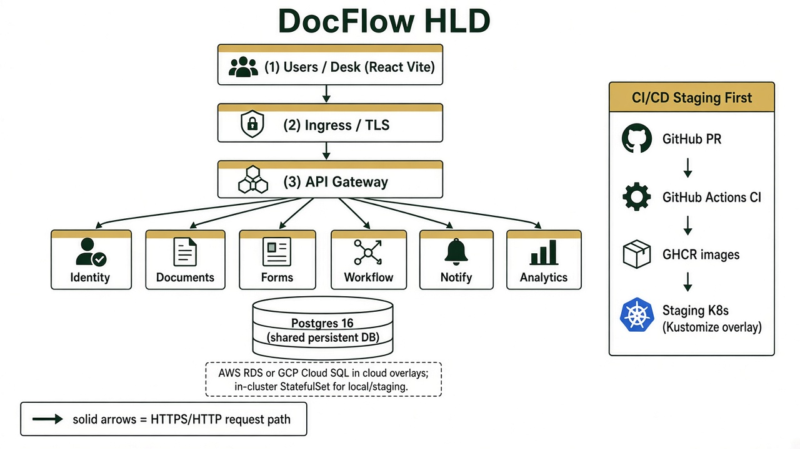
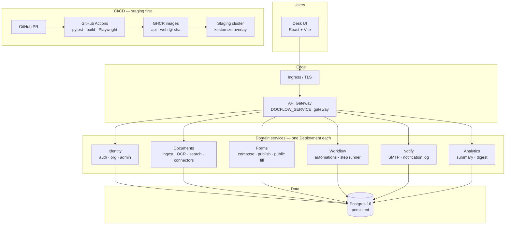

# DocFlow — High-Level Design (HLD)

## Diagram

## Scope

| Concern | Choice |
|---|---|
| Product surface | Desk UI + public form fill |
| Edge | Ingress → Gateway |
| Domains | identity, documents, forms, workflow, notify, analytics |
| Data | One persistent Postgres (shared DB until schema split is justified) |
| Local/CI default | `DOCFLOW_SERVICE=monolith` (same image, all routers) |
| Deploy | Kustomize overlays: `local` → **staging** → `aws` / `gcp` |
| Cloud | Dual path; no lock-in |

## Out of HLD

- Local process/module layout → [`LLD-LOCAL.md`](./LLD-LOCAL.md)
- SaaS row-level multi-tenant → [`LLD-SAAS-TENANT.md`](./LLD-SAAS-TENANT.md)
- **Dedicated cluster + DB per tenant (compute)** → [`TENANT-CELLS.md`](./TENANT-CELLS.md)

## Related

- [`ARCHITECTURE.md`](./ARCHITECTURE.md)
- [`PRODUCTION.md`](./PRODUCTION.md)
- K8s: `infra/k8s/`
