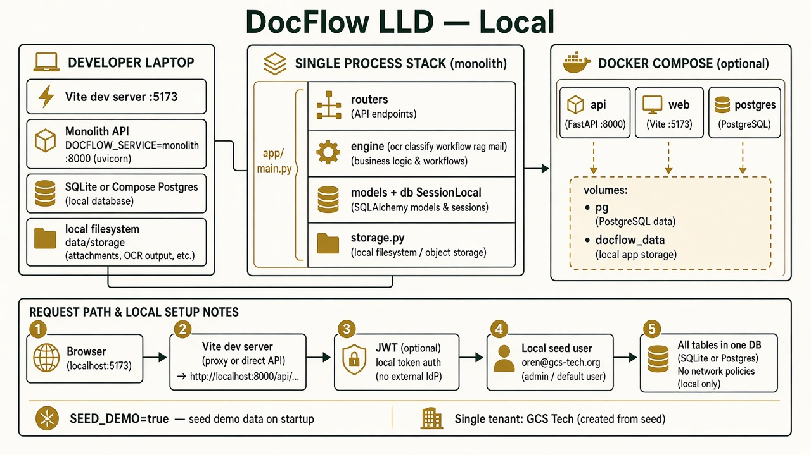
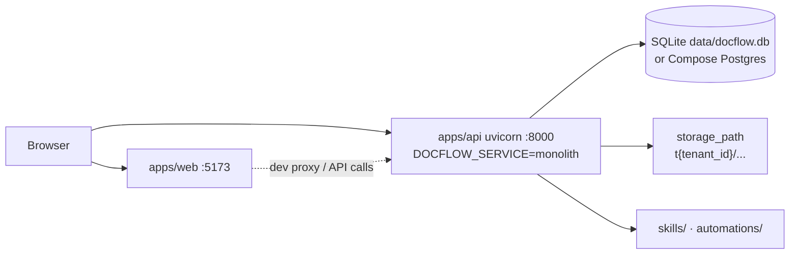
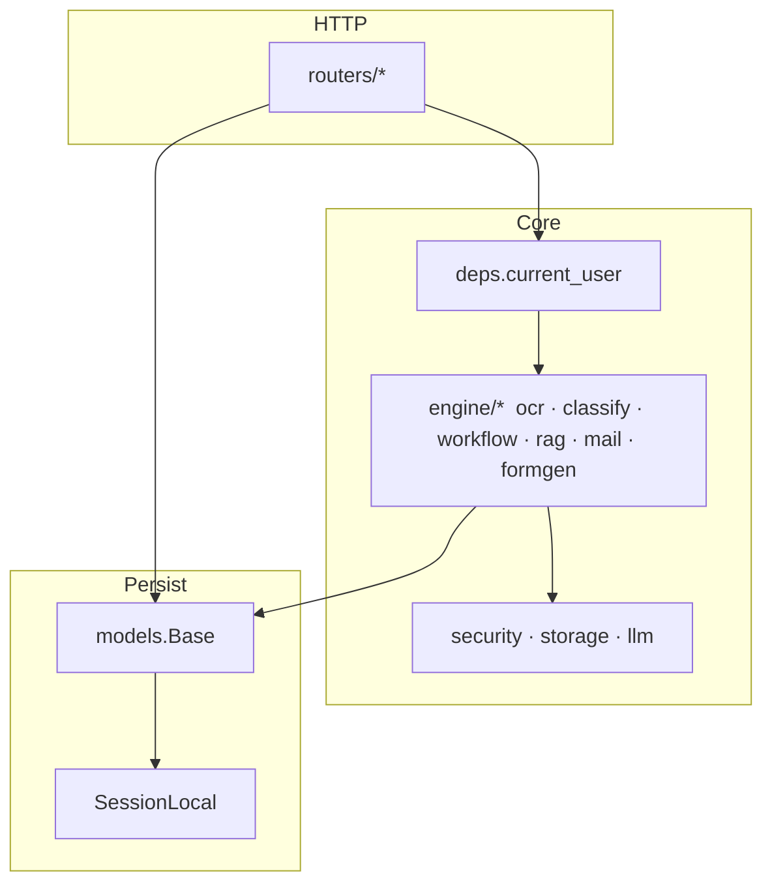

# DocFlow LLD — Local



## Intent

Single-machine (or Compose) run. One process owns all routers. Isolation is soft: one seeded tenant, shared filesystem, no NetworkPolicy.

## Runtime topology



| Piece | Local default |
|---|---|
| Process | One FastAPI app (`main.py`) mounts **all** routers |
| `DOCFLOW_SERVICE` | `monolith` |
| DB | SQLite `data/docflow.db` · Compose: Postgres 16 |
| Seed | `SEED_DEMO=true` → tenant **GCS Tech** (`gcs-tech`) |
| Auth | JWT HS256 · seed password in README |
| Storage | `{STORAGE_PATH}/t{tenant_id}/...` |
| LLM | Ollama on host optional · heuristic fallback |

## In-process layers



## Local request path (document upload)

1. `POST /api/v1/auth/login` → JWT `{uid, tid, role}` (authorization still loads `User` by `uid` from DB).
2. `POST /api/v1/documents` (`require("operator")`) → `storage.put(user.tenant_id, ...)` → `Document(tenant_id=...)`.
3. Orchestrator: OCR → classify → match automation → `WorkflowRun` / `WorkflowStepRun`.
4. Optional notify row; analytics reads same DB.

## Seed principals

| Email | Role | Tenant |
|---|---|---|
| `oren@gcs-tech.org` | `owner` | GCS Tech |
| `admin@docflow.example` | `platform_admin` | GCS Tech |
| `operator@docflow.example` | `operator` | GCS Tech |
| `viewer@docflow.example` | `viewer` | GCS Tech |

## What local deliberately skips

- No gateway hop; no per-service Deployments
- No NetworkPolicy / HPA / Ingress TLS
- Feature flags and `ModelBinding` are global tables (same as SaaS) but only one tenant uses them
- Signup still creates a **new** `Tenant` + `owner` if used — multi-tenant code paths work locally, just not the target posture

## Run

```bash
# monolith
docker compose up --build
# or
cd apps/api && PYTHONPATH=. uvicorn app.main:app --reload
```

See also: [`HLD.md`](./HLD.md) · [`ARCHITECTURE.md`](./ARCHITECTURE.md)
