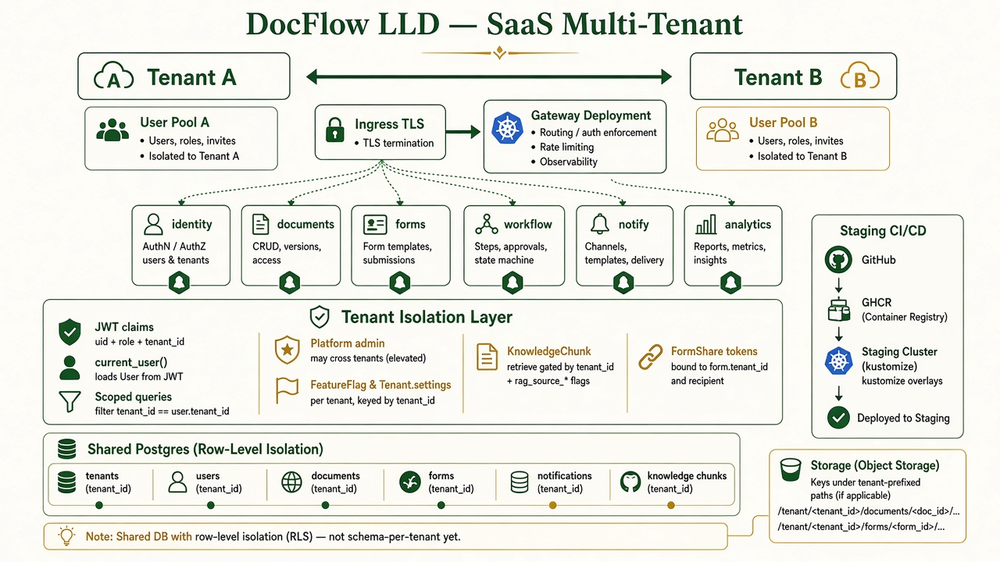
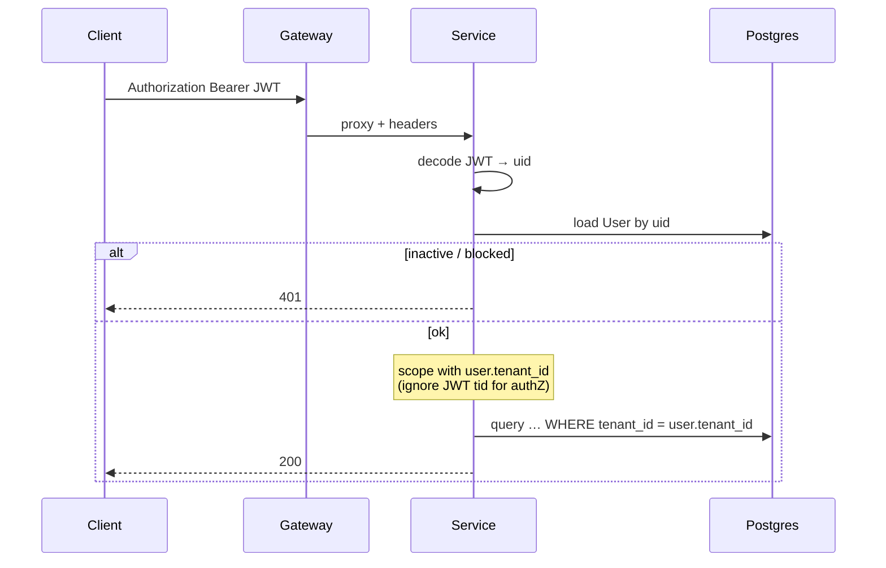

# DocFlow LLD — SaaS multi-tenant



## Intent

Multi-tenant SaaS: many orgs on one platform. **Isolation is row-level** on a shared Postgres (`tenant_id`), not schema-per-tenant yet. Platform operators can cross tenants; tenant users cannot.

## Edge + services

```mermaid
flowchart TB
  TA["Tenant A users"] --> Ingress
  TB["Tenant B users"] --> Ingress
  Ingress["Ingress / TLS"] --> GW["gateway"]
  GW --> ID["identity"]
  GW --> DOC["documents"]
  GW --> FRM["forms"]
  GW --> WF["workflow"]
  GW --> NTF["notify"]
  GW --> AN["analytics"]
  ID & DOC & FRM & WF & NTF & AN --> PG[("Postgres 16<br/>shared · row tenant_id")]
  DOC --> OBJ["Object / PVC storage<br/>t{tenant_id}/..."]
```



Staging-first deploy: GHCR image `@sha` → `infra/k8s/overlays` staging → later `aws` / `gcp` (RDS / Cloud SQL as `DATABASE_URL`).

---

## Tenant dig-in

### Tenant record

| Field | Role |
|---|---|
| `id` | Surrogate key stamped on almost all domain rows |
| `name` / `slug` | Unique org identity (`slug` from register) |
| `plan` | `growth` (signup) · seed uses `scale` |
| `is_active` / `is_suspended` | Platform suspend path |
| `settings` | JSON reserved — **not yet read in app code** |

### Signup (new tenant)

`POST /api/v1/auth/register` (`routers/auth.py`):

1. Reject duplicate email  
2. `slug = slugify(organization)` (+ suffix if collision)  
3. Insert `Tenant(plan="growth")`  
4. Insert `User(role="owner", tenant_id=…)`  
5. Issue JWT  

### Roles (rank high → low)

`platform_admin` > `owner` > `admin` > `operator` > `viewer`

| Actor | Tenant data | Platform |
|---|---|---|
| `platform_admin` | Cross-tenant lists (docs, workflows, search, analytics summary) | Tenants, flags toggle, system RAG |
| `owner` / `admin` | Full own-tenant org + admin console | Read flags; **can write global `ModelBinding`** (soft gap) |
| `operator` | Upload, forms, publish, share | — |
| `viewer` | Read-scoped surfaces | — |

There is **no** `tenant_admin` string — use `owner` / `admin`.

### AuthZ pipeline (every authenticated call)



- JWT carries `uid`, `tid`, `role` but **`deps.current_user` trusts DB `User` via `uid` only**.
- `require(*roles)`: `platform_admin` always passes; else `has_at_least`.
- Optional `X-User-Id`: must match caller unless `platform_admin`.

### Scoping idioms

**Bypass for platform (documents, workflows, automations, search, analytics summary):**
```text
if user.role != "platform_admin":
    q = q.filter(Model.tenant_id == user.tenant_id)
```

**Strict same-tenant (forms, connectors):**
```text
if row.tenant_id != user.tenant_id: → 404
```
(platform_admin does **not** bypass connectors/forms here.)

**Notifications:** always `Notification.tenant_id == user.tenant_id` (even platform_admin).

### Tables by isolation

| Has `tenant_id` | No `tenant_id` (scope via parent / global) |
|---|---|
| `users`, `documents`, `ocr_results`, `workflows`, `workflow_runs`, `automations`, `notifications`, `activities`, `jobs`, `layers`, `folders`, `access_grants`, `forms`, `form_submissions`, `connectors`, `knowledge_chunks`, `record_bags`, … | `extracted_fields` → via `Document`; `form_shares` → via `form_id` + token; `feature_flags`, `model_bindings` → **platform-global**; `refresh_tokens` → via `user_id` |

### Storage

```text
{STORAGE_PATH}/t{tenant_id}/{digest}_{filename}
{STORAGE_PATH}/t{tenant_id}/form-uploads/{form_id}/...
```

Bytes are tenant-prefixed. `storage.get(key)` trusts the key after a tenant-scoped DB fetch.

### RAG under a tenant

- `upsert_chunk` / `retrieve(db, tenant_id, …)` always filter `KnowledgeChunk.tenant_id`.
- Source kinds gated by **global** flags `rag_source_*` (not per-tenant yet).
- Form compose retrieves only that tenant’s chunks.
- Platform `/admin/rag/*` can list across tenants.

### Public form boundary

`/api/v1/public/forms/{token}` — unauthenticated. Token resolves `FormShare` or live `Form.share_token`. Writes land under the **form’s** `tenant_id`. Personal tokens close after first submit.

### Org tree

Layers / folders / grants created with `_tid(user)`.  
**Known soft leak:** `GET /org/tree` loads `LayerMember` without tenant filter (attach by `layer_id`). Treat as hardening item for SaaS.

---

## Per-tenant request examples

### A — Operator in Tenant A uploads

1. JWT → User A (`tenant_id=1`, `operator`)  
2. Document row `tenant_id=1`, file `t1/...`  
3. Workflow run `tenant_id=1`  
4. Tenant B operator **cannot** `GET` that document id (404 / empty list)

### B — Platform admin suspends Tenant B

1. `require("platform_admin")`  
2. `POST /admin/tenants/{id}/suspend` → `is_suspended=true`  
3. Domain lists still use role bypass; enforce suspend checks at login/middleware as hardening

### C — Two tenants, same email domain

Emails are **globally unique** (`User.email` unique). One human ≈ one user ≈ one tenant today (no multi-membership).

---

## SaaS vs local (LLD delta)

| | Local | SaaS multi-tenant |
|---|---|---|
| Process | Monolith | Gateway + N services |
| DB | SQLite / single Postgres | Managed Postgres; same schema |
| Tenants | Usually 1 seeded | N via register |
| Isolation | Code paths exist, low pressure | Row-level `tenant_id` under load |
| Edge | None | Ingress + NetworkPolicy |
| Secrets | Dev defaults | Secret / ESM; `SEED_DEMO=false` |
| Flags / models | Global tables | Still global — **per-tenant flags/bindings = future** |

---

## Hardening backlog (tenant-deep)

1. Enforce `is_suspended` / `is_active` on every `current_user`  
2. Scope `org.tree` `LayerMember` by tenant  
3. Stop tenant `admin` from writing global `ModelBinding`  
4. Per-tenant feature flags or `Tenant.settings` consumers  
5. Schema-per-tenant or Postgres RLS when compliance requires  
6. Suspended-tenant storage GC / encryption at rest  

## Related

- [`HLD.md`](./HLD.md) · [`LLD-LOCAL.md`](./LLD-LOCAL.md) · [`PRODUCTION.md`](./PRODUCTION.md)
- Code: `models.py`, `deps.py`, `security.py`, `routers/auth.py`, `storage.py`, `engine/rag.py`
