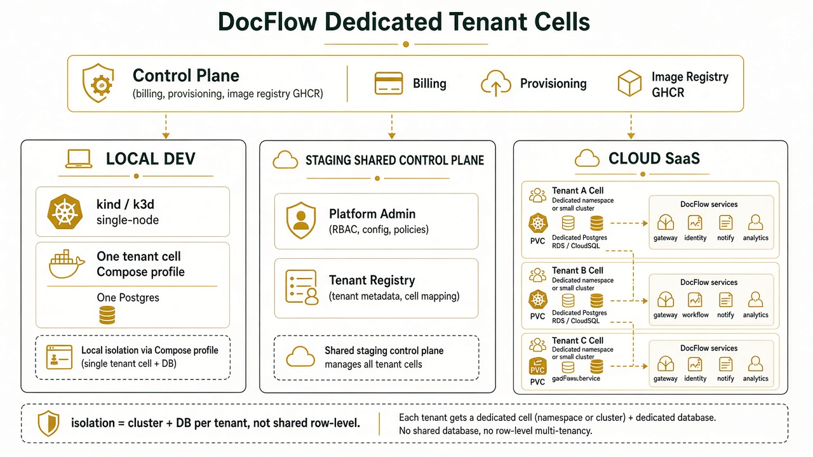
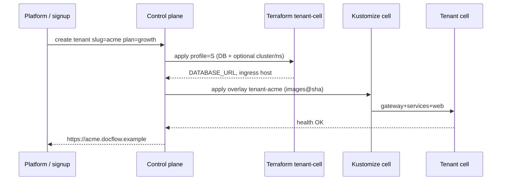

# DocFlow — dedicated tenant cells (compute breakdown)



## Model shift

| Today (shared SaaS) | Target (dedicated cell) |
|---|---|
| One cluster, many tenants | **One cell per tenant** |
| One Postgres, `tenant_id` rows | **One Postgres per tenant** |
| Config mostly global flags | Cell env + `Tenant.settings` in **control plane** only |
| Platform admin bypasses row filters | Platform talks to cells via registry; no shared app DB |

A **tenant cell** = isolated compute + isolated database + DocFlow workloads (gateway + domain services or monolith) + storage.

Control plane (shared, small) = tenant registry, provisioning, billing, image pointers, DNS/routing to cells. It does **not** hold tenant documents.

---

## Cell bill of materials

Every tenant cell runs the same stack:

| Component | Role | Replicas (min) |
|---|---|---|
| `gateway` | Edge API | 2 |
| `identity` | Auth / org / admin (cell-local users) | 1 |
| `documents` | Ingest / OCR / search | 1 |
| `forms` | Forms | 1 |
| `workflow` | Automations / steps | 1 |
| `notify` | SMTP / notifications | 1 |
| `analytics` | Digests | 1 |
| `web` | Desk UI (or shared CDN later) | 1–2 |
| **Postgres 16** | Dedicated DB | 1 primary (+ optional replica) |
| PVC / object store | `t1/…` files (single-tenant; prefix still fine) | 1 bucket or PVC |

**Dev shortcut:** one cell can run `DOCFLOW_SERVICE=monolith` (1 API + 1 web + 1 Postgres) instead of 7 API Deployments.

---

## Compute profiles

Numbers are **starting points** for planning (not SLAs). Assumes DocFlow 2.0 API image + Postgres 16.

### Profile S — small tenant (≤25 users, light forms/docs)

| Resource | Local | Cloud (per cell) |
|---|---|---|
| API (monolith) | 1 × 0.5 vCPU / 1 GiB | 2 × 0.5 vCPU / 1 GiB (or 1×1 vCPU) |
| Web | 1 × 0.1 vCPU / 128 MiB | 2 × 0.25 vCPU / 256 MiB |
| Postgres | 1 × 0.5 vCPU / 1 GiB · 20 GiB disk | db.t4g.micro / Cloud SQL `db-f1-micro` · 20–50 GiB |
| Object / PVC | 20 GiB | 50 GiB S3/GCS |
| **Cell total (approx)** | **~1.5 vCPU / 2.5 GiB** | **~2–3 vCPU / 3–4 GiB** + managed DB |

### Profile M — growth (≤100 users, OCR + RAG)

| Resource | Local | Cloud |
|---|---|---|
| Microservices (7 API) | not typical on laptop | 7 × 0.5–1 vCPU / 512Mi–1Gi · HPA on gateway/documents |
| Web | — | 2 × 0.25 / 256Mi |
| Postgres | — | db.t4g.small / `db-custom-2-7680` · 100 GiB |
| Object | — | 200 GiB |
| **Cell total (approx)** | use Profile S monolith | **~6–10 vCPU / 10–14 GiB** + DB |

### Profile L — heavy (field crews, invoice volume, OCR)

| Resource | Cloud |
|---|---|
| documents + workflow | 2–4 replicas · 1–2 vCPU / 2 GiB each |
| Other APIs | 1–2 × 0.5 / 1 GiB |
| Postgres | db.r6g.large / Cloud SQL enterprise · 500 GiB+ · HA |
| Object | 1 TiB+ |
| **Cell total (approx)** | **~16–32 vCPU / 32–64 GiB** + HA DB |

Map `Tenant.plan` → profile: `growth`→S, `scale`→M, `enterprise`→L.

---

## Local (every tenant = own cell)

### Option A — Compose project per tenant (simplest)

```bash
# tenant acme
export COMPOSE_PROJECT_NAME=docflow-acme
export POSTGRES_DB=docflow_acme
export HOST_API_PORT=8101
export HOST_WEB_PORT=5181
docker compose -f docker-compose.tenant-cell.yml up -d
```

Each project gets its own network, Postgres volume, and published ports. No shared DB.

### Option B — kind / k3d: namespace = cell

```text
cluster: docflow-local (one node)
  namespace tenant-acme   → full DocFlow + Postgres PVC
  namespace tenant-globex → full DocFlow + Postgres PVC
```

Still “own DB”; cluster is shared hardware, **logical** isolation. True “own cluster” locally = separate kind clusters (`kind create cluster --name tenant-acme`) — heavy on RAM.

### Local RAM guide

| Setup | RAM budget |
|---|---|
| 1 cell monolith + Postgres | ≥ 4 GiB free |
| 2 cells monolith | ≥ 8 GiB |
| 1 cell full microservices | ≥ 8–10 GiB |
| 2 kind clusters | ≥ 16 GiB |

---

## Cloud (every tenant = own cluster + DB)

### Isolation tiers (pick per plan)

| Tier | Compute | Database | When |
|---|---|---|---|
| **Cell namespace** | Shared EKS/GKE, dedicated namespace + NetworkPolicy + Quotas | Dedicated RDS/Cloud SQL instance | Cost-efficient SaaS |
| **Cell cluster** | Dedicated EKS/GKE (or Autopilot/Fargate profile) per tenant | Dedicated DB | Regulated / enterprise |
| **Cell account** | Dedicated cloud account/subscription | Dedicated DB | Strongest blast-radius |

Default recommendation: **namespace cell + dedicated DB** for S/M; **dedicated cluster + DB** for L/enterprise.

### AWS sketch (per tenant)

| Piece | Resource |
|---|---|
| DB | RDS Postgres 16 · private subnets · password in Secrets Manager |
| Compute | EKS namespace `tenant-{slug}` **or** dedicated EKS |
| Images | GHCR / ECR pull through |
| Storage | S3 `docflow-{slug}-docs` |
| Ingress | ALB + host `-{slug}.docflow.example` |
| Secrets | `DATABASE_URL`, `SECRET_KEY` per cell |

### GCP sketch (per tenant)

| Piece | Resource |
|---|---|
| DB | Cloud SQL Postgres 16 |
| Compute | GKE namespace or dedicated GKE Autopilot |
| Images | Artifact Registry |
| Storage | GCS bucket |
| Ingress | GCLB / Gateway · `-{slug}.docflow.example` |
| Secrets | Secret Manager |

### Control plane (shared, once)

- Tenant registry: `slug`, plan/profile, cell endpoint, DB ARN/connection name, status  
- Provisioner job (GHA or operator): apply TF module `tenant-cell` + kustomize overlay  
- Global DNS / auth portal that routes `slug` → cell gateway  
- Billing meter per cell (vCPU-hours + DB storage)

---

## Provisioning flow



---

## Cost / density (order of magnitude)

Shared row-level SaaS packs **dozens–hundreds** of tenants per cluster.  
Dedicated DB alone ≈ **1 managed DB minimum charge per tenant**.  
Dedicated cluster per tenant ≈ **highest**; use only for enterprise.

| Tenants | Suggested tier |
|---|---|
| 1–10 (pilot) | Namespace cell + dedicated DB |
| 10–100 | Same; Autopilot/Fargate; automate TF |
| Enterprise contracts | Dedicated cluster or account |

---

## Repo layout (this PR)

```
infra/
  terraform/
    modules/tenant-cell/     # reusable DB + optional cluster bindings
    aws/ · gcp/              # shared hub / VPC sketches
  k8s/
    base/                    # DocFlow workloads
    overlays/
      local/
      staging/
      tenant-cell/           # template: set namespace + secrets
docs/
  TENANT-CELLS.md            # this file
```

---

## Migration from shared DB

1. Keep control plane registry of tenants  
2. For each tenant: spin cell → dump/restore rows `WHERE tenant_id=N` → cut DNS  
3. Drop shared app DB when empty  
4. App code can keep `tenant_id=1` inside a cell (single-tenant mode) or ignore multi-tenant filters when `TENANT_MODE=dedicated`

Env: `TENANT_MODE=shared|dedicated` · `TENANT_SLUG=acme`.

## Related

- [`HLD.md`](./HLD.md) · [`LLD-LOCAL.md`](./LLD-LOCAL.md) · [`LLD-SAAS-TENANT.md`](./LLD-SAAS-TENANT.md) (row-level model — predecessor)  
- [`ARCHITECTURE.md`](./ARCHITECTURE.md)
